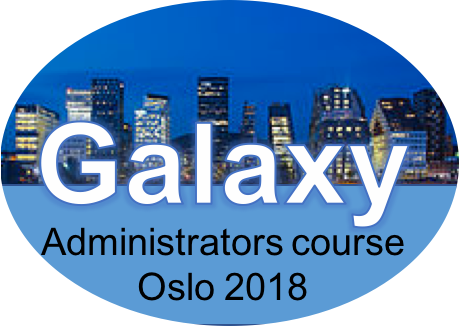

# Galaxy Administrators Course

**Oslo, 8th to 12th January 2018**

[Event Logistics](https://docs.google.com/document/d/17ZpNQu6cC6tx-WNF6iN7T7Gu2TrOJthS98KglJa6k9s/edit?usp=sharing) | 

jump to [Monday](#monday) | [Tuesday](#tuesday) | [Wednesday](#wednesday) | [Thursday](#thursday) | [Friday](#friday)

Built slides have [an index](https://galaxyproject.github.io/dagobah-training/2018-oslo/).

[Galaxy Training material](http://galaxyproject.github.io/training-material/)

[Information and questions (Google Doc)](https://docs.google.com/document/d/1eo12xrdNIrFD1_SLDMQKXteysOGkR2c8l-sR_hl6sok/edit?usp=sharing)

### Instructors

* (B)jörn Grüning - ELIXIR Galaxy WG, Elixir Germany, de.NBI, University of Freiburg, Germany
* (M)arius van den Beek - ELIXIR Galaxy WG, Institute Curie, Paris, France
* (N)icola Soranzo - ELIXIR Galaxy WG, Earlham Institute, UK
* (E)nis Afgan - Galaxy Project, Johns Hopkins University, USA
* (A)bdulrahman Azab - ELIXIR Galaxy WG, PRACE, NeIC, USIT, University of Oslo, Norway

### Location

Building: [Ole Johan Dahls hus, University of Oslo](https://www.uio.no/english/about/getting-around/areas/gaustad/ga06/)

Room: [Seminar room Prolog (Room number: 2465, 2nd floor)](https://tp.uio.no/timeplan/?type=room&area=GA&building=GA06&id=GA062465&week=02&ar=2018&lang=en)

## Timetable

Timetable with sessions and material will be continously updated towards the workshop.

## Timetable
#### Monday
**8th January** - Location

| **Time** | **Topic** | **Links** | **Instructor** |
| -------- | --------- | --------- | ----------- |
| 08:30 | Registration |  |  |
| 09:15 | Welcome and introduction | [Slides](https://galaxyproject.github.io/dagobah-training/2018-oslo/00-intro/intro.html) | All |
| 09:30 | Deployment and platform options | [Slides](http://galaxyproject.github.io/training-material/topics/admin/tutorials/deployment-platforms-options/slides.html) | (B) |
| 10:00 | Get a basic Galaxy server up and running | [Slides](https://galaxyproject.github.io/dagobah-training/2018-oslo/02-basic-server/get-galaxy.html) | (A) |
| 10:45 | **Morning break** | | |
| 11:00 | Galaxy server optional necessities: PostgreSQL and nginx | [First Steps Slides](https://galaxyproject.github.io/dagobah-training/2018-oslo/03-production-basics/production.html), [First Steps Exercise](sessions/03-production-basics/ex1-first-steps.md), [PostgreSQL Slides](https://galaxyproject.github.io/dagobah-training/2018-oslo/03-production-basics/databases.html), [PostgreSQL Exercise](sessions/03-production-basics/ex2-postgres.md),  [nginx/Apache Slides](https://galaxyproject.github.io/dagobah-training/2018-oslo/03-production-basics/webservers.html), [nginx Exercise](sessions/03-production-basics/ex3-nginx.md), [Apache Exercise](sessions/03-production-basics/ex4-apache.md) (for reference)| (N) |
| 12:15 | **Lunch** | | |
| 13:00 | Galaxy server optional necessities (continued)| | |
| 13:45 | Introduction to the Galaxy Tool Shed: Identifying and installing well-defined tools | [Slides (Shed)](https://galaxyproject.github.io/dagobah-training/2018-oslo/04-tool-shed/shed_intro.html), [Slides (Tools)](https://galaxyproject.github.io/dagobah-training/2018-oslo/04-tool-shed/tool_installation.html), [Slides (Dependencies)](https://galaxyproject.github.io/dagobah-training/2018-oslo/04-tool-shed/tool-dependencies.html)| (M) |
| 15:00 | **Afternoon break** | | |
| 15:15 | Defining and importing genomes, Data Managers | [Slides](https://galaxyproject.github.io/dagobah-training/2018-oslo/05-reference-genomes/reference_genomes.html), [Exercise](sessions/05-reference-genomes/ex1-reference-genomes.md) | (E) |
| 16:50 | Extending your installation: FTP, SMTP, and more | [Slides](https://galaxyproject.github.io/dagobah-training/2018-oslo/06-extending-installation/extending.html), [Exercise](sessions/06-extending-installation/ex1-proftpd.md) | (A) |
| 18:00 | Close Day 1 | | All |

#### Tuesday
**9th January**  - Location

| **Time** | **Topic** | **Links** | **Instructor** |
| -------- | --------- | --------- | ----------- |
| 09:00 | Welcome and questions |  | All |
| 09:15 | Users, Groups, and Quotas | [Slides](http://galaxyproject.github.io/training-material/topics/admin/tutorials/users-groups-quotas/slides.html) | (B) |
| 10:45 | **Morning break** | | |
| 11:00 | Updating tools and supporting multiple versions of tools | [Exercise](sessions/04-tool-shed/ex-tool-management.md) | (M) |
| 12:30 | **Lunch** | | |
| 13:15 | Improving the web serving experience with uWSGI | [Slides](https://galaxyproject.github.io/dagobah-training/2018-oslo/10-uwsgi/uwsgi.html) [Exercise](sessions/10-uwsgi/ex1-uwsgi.md) | (B) |
| 14:15 | Controlling Galaxy with systemd and supervisor | [Slides](https://galaxyproject.github.io/dagobah-training/2018-oslo/11-systemd-supervisor/systemd-supervisor.html), [Exercise](sessions/11-systemd-supervisor/ex1-supervisor.md) | (E) |
| 15:15 | **Afternoon break** | | |
| 15:30 | Server monitoring and maintenance: Admin UI, Log files, Direct database queries, command line & scripts, what to backup and how | [Slides](http://galaxyproject.github.io/training-material/topics/admin/tutorials/monitoring-maintenance/slides.html), [Exercise](http://galaxyproject.github.io/training-material/topics/admin/tutorials/monitoring-maintenance/tutorial.html) | (B) |
| 16:30 | Using and configuring external authentication services | [Slides](https://galaxyproject.github.io/dagobah-training/2018-oslo/13-external-auth/external-auth.html), [PAM Auth Exercise](sessions/13-external-auth/ex1-pam-auth.md), [Upstream Auth Exercise](sessions/13-external-auth/ex2-upstream-auth.md) | (N) |
| 17:45 | Close Day 2 | | All |

**Free common dinner at 7pm at [Elias mat og sånt](http://www.cafeelias.no/nb/) located downtown.**

#### Wednesday
**10th January**  - Location

| **Time** | **Topic** | **Links** | **Instructor** |
| -------- | --------- | --------- | ----------- |
| 09:00 | Welcome and questions |  | All |
| 09:15 | Configuration management choices: Introduction to Ansible | [Slides](https://galaxyproject.github.io/dagobah-training/2018-oslo/14-ansible/ansible-introduction.html) | (E) |
| 10:00 | Using Ansible to deploy Galaxy I | [Exercise 1](sessions/14-ansible/ex1-intro-ansible.md) | (E) |
| 10:45 | **Morning break** | | |
| 11:00 | Using Ansible to deploy Galaxy II | [Exercise 2](sessions/14-ansible/ex2-galaxy-ansible.md) | (E) |
| 12:30 | **Lunch** | | |
| 13:15 | Exploring the Galaxy job configuration file | [Slides](https://galaxyproject.github.io/dagobah-training/2018-oslo/15-job-conf/job_conf.html) | (N) |
| 13:50 | Connecting Galaxy to a compute cluster I | [Slides](http://galaxyproject.github.io/training-material/topics/admin/tutorials/connect-to-compute-cluster/slides.html), [Exercise](http://galaxyproject.github.io/training-material/topics/admin/tutorials/connect-to-compute-cluster/tutorial.html) | (B) |
| 15:30 | **Afternoon break** | | |
| 15:45 | Connecting Galaxy to a compute cluster II |  | (B) |
| 16:30 | Using heterogeneous compute resources | [Slides](https://galaxyproject.github.io/dagobah-training/2018-oslo/17-heterogenous/heterogeneous.html), [Exercise](sessions/17-heterogenous/ex1-pulsar.md) | (M) |
| 17:30 | Using public and private cloud compute resources | [Slides](https://galaxyproject.github.io/dagobah-training/2018-oslo/18-clouds/clouds.html) | (E) |
| 18:00 | Close day 3 | | All |

#### Thursday
**11th January**  - Location

| **Time** | **Topic** | **Links** | **Instructor** |
| -------- | --------- | --------- | ----------- |
| 09:00 | Welcome and questions |  | All |
| 09:15 | Storage management and using heterogeneous storage services | [Slides](https://galaxyproject.github.io/dagobah-training/2018-oslo/19-storage/storage.html), [Exercise](sessions/19-storage/ex1-objectstore.md) | (E) |
| 10:45 | **Morning break** | | |
| 11:00 | Containerize all the things: Galaxy in Docker and Docker in Galaxy | [Docker Slides](https://galaxy.slides.com/bgruening/the-galaxy-docker-project) [Conda Slides](http://galaxy.slides.com/bgruening/deck-7#/) | (B) |
| 12:30 | **Lunch** | | |
| 13:15 | Running Jupyter in Galaxy with Galaxy Interactive Environments | [Exercise](sessions/21-gie/ex1-jupyter.md) | (B) |
| 15:30 | **Afternoon break** | | |
| 15.45 | Uwsgi + mules | | (?) |
| 16:45 | OPEN: Lightning talks | | |
| 18:00 | Wrap up and close | | All |

#### Friday
**12th January**  - Location

| **Time** | **Topic** | **Links** | **Instructor** |
| -------- | --------- | --------- | ----------- |
| 09:00 | Welcome and questions |  | All |
| 09.15 | Lightning talks (continued) | | (?) |
| 10:15 | Upgrading to a new Galaxy release | [Slides](https://galaxyproject.github.io/dagobah-training/2018-oslo/08-upgrading-release/upgrading.html) | (N) |
| 10:45 | **Morning break** | | |
| 11.00 | Whats new in Galaxy 18.01? | | (?) |
| 12:30 | **Lunch** | | |
| 13:15 | When things go wrong: Galaxy Server Troubleshooting | [Slides](https://galaxyproject.github.io/dagobah-training/2018-oslo/22-troubleshooting/troubleshooting.html) | (M) |
| 15:30 | Wrap up and close | | All |
