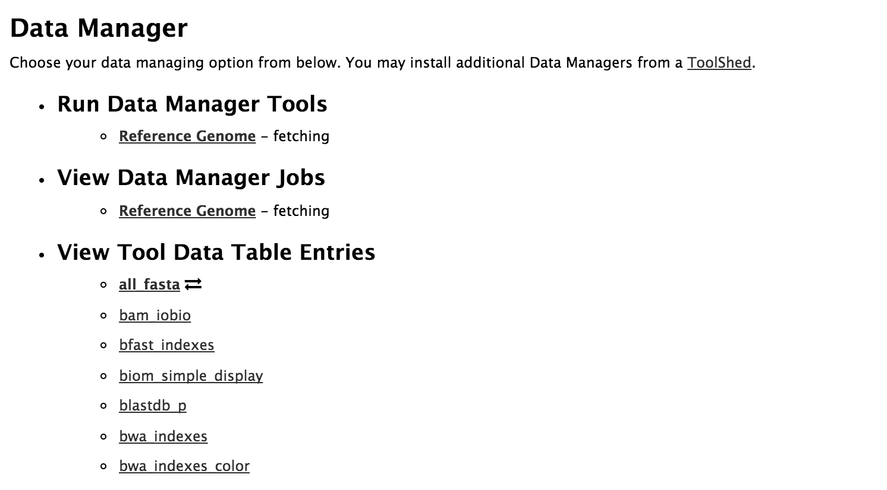
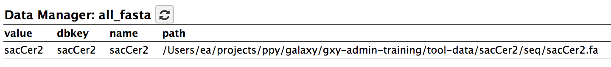

### Oslo2018 - Oslo, Norway

# Reference Genomes - Exercise

## Learning Outcomes

By the end of this tutorial, you should:

1. Have an understanding of the way in which Galaxy stores and uses reference data
2. Be able to add a reference genome and its pre-calculated indices into the Galaxy reference data system
3. Be able to download and use data managers to automate the process described in 2.

## Introduction

A slideshow presentation on this subject can be found [here](https://galaxyproject.github.io/dagobah-training/2018-oslo/05-reference-genomes/reference_genomes.html#1)

Reference genomes such as the **human, mouse, arabidopsis** etc. are all quite large. They are used extensively in bioinformatic analyses and therefore need to be widely available in analysis systems. These genomes can take up quite a bit of disk space to store especially if every user has their own copy. A lot of bioinformatic tools need to index these large genomes before they can use them. Tools such as short read mappers like **BWA** or **Bowtie** calculate indices of the genome sequences to significantly speed up their processing of short reads. However, these indices take a long time to build and it would be impractical to build them every time you want to do a read mapping.

Therefore, Galaxy has a system for storing reference sequences and pre-calculating the indices for each tool. They are all only stored once per Galaxy server and shared for every user. They are available for direct use in tools to save time. In this tutorial, we will be adding a new genome sequence to our Galaxy server, building it's indices for various tools and making them available for tool wrappers via the abstraction layer.

We will be using two different methods.
  1. A manual method by editing all of the appropriate files
  2. Using a set of **data managers** to automate the process

*fig 1. A schematic layout of the of Interplay between Built-in Data and Galaxy Tools*


## Section 1 - \*.loc files 101: Doing it manually!

*Loc* or *location* files are used as a way to provide additional configuration details to a tool without having to manually edit the actual tool XML file. They are often used to store the path (location on disk) of reference data and indices, along with appropriate metadata (display names, dbkeys/genome builds). They need not end in the suffix of ".loc", although they commonly do by convention.

Most importantly they are **Tab delimited** (not *space* delimited) flat files, where each row is an entry in the table. They also should not be accessed directly in a tool. Instead, the Tool Data Tables abstraction layer should be used.

### Exercise 1: Example of typical use of reference data in a Galaxy tool

* Search toolshed for a tool that uses reference data, say the **bwa** tool
  * http://toolshed.g2.bx.psu.edu/view/devteam/bwa
* Click **Repository Actions** button and select **Browse repository tip files**
* Find and click on *bwa_macros.xml* and note the section that uses indexed data, in particular note the XML block beginning with `<macro name="reference_source_conditional">`. These lines in the tool wrapper refer to the `bwa_mem_indexes` table defined in the *tool_data_table_conf.xml* file.

  ``` xml
  <macro name="reference_source_conditional">
    <conditional name="reference_source">
      <param name="reference_source_selector" type="select" label="Will you select a reference genome from your history or use a built-in index?" help="Built-ins were indexed using default options. See `Indexes` section of help below">
        <option value="cached">Use a built-in genome index</option>
        <option value="history">Use a genome from history and build index</option>
      </param>
      <when value="cached">
        <param name="ref_file" type="select" label="Using reference genome" help="Select genome from the list">
          <options from_data_table="bwa_mem_indexes">
            <filter type="sort_by" column="2" />
            <validator type="no_options" message="No indexes are available" />
          </options>
          <validator type="no_options" message="A built-in reference genome is not available for the build associated with the selected input file"/>
        </param>
      </when>
      <when value="history">
        <param name="ref_file" type="data" format="fasta" label="Use the following dataset as the reference sequence" help="You can upload a FASTA sequence to the history and use it as reference" />
        <param name="index_a" type="select" label="Algorithm for constructing the BWT index" help="(-a)">
          <option value="auto">Auto. Let BWA decide the best algorithm to use</option>
          <option value="is">IS linear-time algorithm for constructing suffix array. It requires 5.37N memory where N is the size of the database. IS is moderately fast, but does not work with database larger than 2GB</option>
          <option value="bwtsw">BWT-SW algorithm. This method works also with big genomes</option>
        </param>
      </when>
    </conditional>
  </macro>
  ```

* Now Find and click on *tool_data_table_conf.xml.sample* which defines the
  mapping to the *tool-data/bwa_mem_index.loc* file. Note that column 2 in the
  above tool file under `<options from_data_table="bwa_mem_indexes">` is listed
  here as `name` or the name of the reference sequence (0 indexed list).

  ``` xml
  <tables>
      <table name="bwa_mem_indexes" comment_char="#">
          <columns>value, dbkey, name, path</columns>
          <file path="tool-data/bwa_mem_index.loc" />
      </table>
  </tables>
  ```

* Find and click on *tool-data/bwa_mem_index.loc.sample*. This is a sample .loc
  file for the bwa mapping tool. It contains the names and paths to the actual
  indices.

  ```
  #This is a sample file distributed with Galaxy that enables tools
  #to use a directory of BWA indexed sequences data files. You will need
  #to create these data files and then create a bwa_index.loc file
  #similar to this one (store it in this directory) that points to
  #the directories in which those files are stored. The bwa_index.loc
  #file has this format (longer white space characters are TAB characters):
  #
  #<unique_build_id>   <dbkey>   <display_name>   <file_path>
  #
  #So, for example, if you had phiX indexed stored in 
  #/depot/data2/galaxy/phiX/base/, 
  #then the bwa_index.loc entry would look like this:
  #
  #phiX174   phiX   phiX Pretty   /depot/data2/galaxy/phiX/base/phiX.fa
  #
  #and your /depot/data2/galaxy/phiX/base/ directory
  #would contain phiX.fa.* files:
  #
  #-rw-r--r--  1 james    universe 830134 2005-09-13 10:12 phiX.fa.amb
  #-rw-r--r--  1 james    universe 527388 2005-09-13 10:12 phiX.fa.ann
  #-rw-r--r--  1 james    universe 269808 2005-09-13 10:12 phiX.fa.bwt
  #...etc...
  #
  #Your bwa_index.loc file should include an entry per line for each
  #index set you have stored. The "file" in the path does not actually
  #exist, but it is the prefix for the actual index files.  For example:
  #
  #phiX174	phiX	phiX174	/depot/data2/galaxy/phiX/base/phiX.fa
  #hg18canon	hg18	hg18 Canonical	/depot/data2/galaxy/hg18/base/hg18canon.fa
  #hg18full	hg18	hg18 Full	/depot/data2/galaxy/hg18/base/hg18full.fa
  #/orig/path/hg19.fa	hg19	hg19	/depot/data2/galaxy/hg19/base/hg19.fa
  #...etc...
  #
  #Note that for backwards compatibility with workflows, the unique ID of
  #an entry must be the path that was in the original loc file, because that
  #is the value stored in the workflow for that parameter. That is why the
  #hg19 entry above looks odd. New genomes can be better-looking.
  #
  ```

**NOTE:** When editing .loc files, your editor **MUST** use **TABS** and not expand them into spaces.
* In **vim** use the command *:set noexpandtab*

### Excercise 2: Manually add a genome to the BWA tool list.

In this exercise we will be adding a reference genome to our Galaxy server by
manually editing all of the required files (use your favourite editor, but
remember to make sure it uses real TABs, not TABs expanded into spaces).

We will:

1. Add ourselves as admin users to our Galaxy servers(if we haven't already)
2. Install the BWA toolsuite
3. Add a reference genome to our server
4. Index the reference genome for BWA.
5. Test it all out!

If you are already an Admin user on your Galaxy server and it already has BWA installed, start at *Part 3*.

**Part 1: Add admin user**

Skip this part if you are already an admin user of your Galaxy server!

* Login to your Galaxy server
* Check if your username is an admin user:
``` bash
  cd /srv/galaxy/config
  grep admin_users galaxy.ini
```
* It should return `admin_users = ` followed by a comma delimited list of user emails. If yours is not there, it needs to be added. Use only commas to delimit different admin users - no spaces!
* If you make any changes to the galaxy.ini file, you need to restart Galaxy before they will take effect.
* For Galaxy running in daemon mode:
``` bash
  sudo -Hu galaxy galaxy --stop-daemon
  sudo -Hu galaxy galaxy --daemon
```
* Watch the Galaxy log file with `tail -f /srv/galaxy/log/paster.log`.
* Test you are an Admin user by logging into your Galaxy server as the username you added to `galaxy.ini`
* You should see an "Admin" menu item at the top of the Galaxy interface.

**Part 2: Install the BWA tool**

Skip this part if BWA is already installed on your Galaxy server!

* From the Galaxy admin page:
  * Click **Search Tool Shed**
  * Click *Galaxy Main Tool Shed*
  * Search for *bwa*
  * Select *bwa* owned by devteam
  * Click **Install to Galaxy**
  * Click **Install**
  * Watch the interface and wait until BWA is installed.

* Check it worked
  * In your terminal window view *config/shed_tool_conf.xml*, it should now
    contain a bwa entry.
  * View *config/shed_tool_data_table_conf.xml*. It should have the contents of
    bwa's *tool_data_table_conf.xml.sample* table entries added (as well as
    Tool Shed repository installation details).
  * There should be a *tool-data/bwa_mem_index.loc* file (copied from
    `bwa_mem_index.loc.sample` if not already created)
* Upload some sample FASTQ datasets:
  ```
  http://www.bx.psu.edu/~dan/examples/gcc2014/data_manager_workshop/fastq/SRR507778-10k_1.fastqsanger
  http://www.bx.psu.edu/~dan/examples/gcc2014/data_manager_workshop/fastq/SRR507778-10k_2.fastqsanger
  ```
  * These are paired end datasets created using Illumina technology, obtained from EBI SRA, and decreased to ~10,000 reads.
  * When uploading these datasets set the datatype to "fastqsanger".
  * Click the "Analyze Data" menu item and select the **Map with BWA** tool.
  * Note the choices available under **Using reference genome** hint: this list should be empty (or at least not contain SacCer1).

**Part 3: Add a new reference genome**

We will be adding a new built-in reference dataset, the _sacCer1_ genome build (good old Saccharomyces cerevisiae - beer yeast). We will download the fasta sequence file for it, index it for bwa, and edit all of the appropriate Galaxy `.loc` file.
It it typically better to place these files under a directory external to the Galaxy server code but for the demonstration purposes today, we are going to place it in the default location, under `$GALAXY_HOME/tool-data`.

* Get the reference genome in the FASTA format.
  * As the Galaxy user (e.g. `sudo -Hsu galaxy`):
  ``` bash
  cd /srv/galaxy/server/tool-data/
  mkdir -p sacCer1/seq
  cd sacCer1/seq
  wget http://www.bx.psu.edu/~dan/examples/gcc2014/data_manager_workshop/sacCer1/sacCer1.fa
  ```

**Part 4: Create BWA indexes for the reference genome.**

**NOTE:** This is kind of the hard part. We need to have BWA available on the command line and in the PATH environment variable. We can either install a separate commandline BWA or use the one installed in Galaxy. It's probably better to use the Galaxy one as sometimes tool developers change the format of their index tables. :(

* Put BWA into the PATH.
  * Galaxy uses Conda by default for dependency management so the best way to
    get Conda into the PATH is to activate the relevant Conda environment. We
    can activate the Conda environment that Galaxy uses and look for which
    environment bwa got installed into and activate it:
    ``` console
    cd /srv/galaxy/dependencies/
    source _conda/bin/activate
    conda info --envs
    source activate mulled-v1-a1698655ddc683fd2767d127c7c583056e87322876f94e167ba3900da02c1fc4
    ```

    We can now run the `bwa` command:
    ``` console
    $ bwa

    Program: bwa (alignment via Burrows-Wheeler transformation)
    Version: 0.7.17-r1188
    Contact: Heng Li <lh3@sanger.ac.uk>

    Usage:   bwa <command> [options]

    Command: index         index sequences in the FASTA format
            mem           BWA-MEM algorithm
            fastmap       identify super-maximal exact matches
            pemerge       merge overlapping paired ends (EXPERIMENTAL)
            aln           gapped/ungapped alignment
            samse         generate alignment (single ended)
            sampe         generate alignment (paired ended)
            bwasw         BWA-SW for long queries

            shm           manage indices in shared memory
            fa2pac        convert FASTA to PAC format
            pac2bwt       generate BWT from PAC
            pac2bwtgen    alternative algorithm for generating BWT
            bwtupdate     update .bwt to the new format
            bwt2sa        generate SA from BWT and Occ

    Note: To use BWA, you need to first index the genome with `bwa index'.
          There are three alignment algorithms in BWA: `mem', `bwasw', and
          `aln/samse/sampe'. If you are not sure which to use, try `bwa mem'
          first. Please `man ./bwa.1' for the manual.
    ```

* Now we can use bwa to build the index! Go back to the sacCer1 directory in `tool-data`. From Galaxy root:

  ``` bash
  $ cd /srv/galaxy/server/tool-data/sacCer1
  $ mkdir bwa_index
  $ cd bwa_index
  $ ln -s ../seq/sacCer1.fa sacCer1.fa
  $ bwa index sacCer1.fa
  $ ls -lh
  total 41576
  lrwxr-xr-x  1 ea  staff    20B Dec 15 15:20 sacCer1.fa -> ../seq/sacCer1.fa
  -rw-r--r--  1 ea  staff    14B Dec 15 15:20 sacCer1.fa.amb
  -rw-r--r--  1 ea  staff   547B Dec 15 15:20 sacCer1.fa.ann
  -rw-r--r--  1 ea  staff    12M Dec 15 15:20 sacCer1.fa.bwt
  -rw-r--r--  1 ea  staff   2.9M Dec 15 15:20 sacCer1.fa.pac
  -rw-r--r--  1 ea  staff   5.8M Dec 15 15:20 sacCer1.fa.sa
  ```  
* We must now add it to the `.loc` file. Add the following line to the end of
  the *tool-data/bwa_mem_index.loc* file. Remember to use TABs (*:set noexpandtab* in vim).

  ```
  sacCer1     sacCer1 S. cerevisiae Oct. 2003 (SGD/sacCer1) (sacCer1) /srv/galaxy/server/tool-data/sacCer1/bwa_index/sacCer1/sacCer1.fa
  ```
* Now, all that's left to do is add the `bwa_mem_index` data table to the tool data table config file. Make a copy from the sample and add the new table to the bottom:

  ```console
  cd /srv/galaxy/config
  vi tool_data_table_conf.xml
  ```

  ```xml
      <table name="bwa_mem_indexes" comment_char="#" allow_duplicate_entries="False">
          <columns>value, dbkey, name, path</columns>
          <file path="tool-data/bwa_mem_index.loc" />
      </table>
  ```

**Part 5: Test it all out**

Now we'll check the BWA tool for the new reference entry.

* Restart your galaxy server.
* Check the BWA tool for the new entry in your web browser

**NOTE:** If the your new entry does not appear, did you remember to separate the fields with TAB characters.

* Align your FASTQ reads using the BWA tool to the newly added built-in reference genome data.

Phew, that was a lot of work. Imagine doing that for ~10 genomes and for ~10-20 tools! There has to be a better way. Luckily, there is!

----

## Section 2 - Data managers 101: Fully Auto

**The problem**

The Galaxy server administrator needed to know how to update each type of reference data. Know how to run the index builds. Know where to get the data from!

**Data managers to the rescue**

Data Managers are a special class of Galaxy tool which allows for the download and/or creation of data that is stored within Tool Data Tables and their underlying flat (e.g. .loc) files. These tools handle the creation of indices and the addition of entries/lines to the data table / .loc file via the Galaxy admin interface.

Data Managers can be defined locally or installed through the Tool Shed.

They are a flexible framework for adding reference data to Galaxy (not just genomic data). They are workflow compatible and can run via the Galaxy API.

More detailed background information on data managers can be found at: [https://galaxyproject.org/admin/tools/data-managers/](https://galaxyproject.org/admin/tools/data-managers/) (A summary of which appears below.)

Details on how to define a data manager for a tool can be found here: [https://galaxyproject.org/admin/tools/data-managers/how-to/define/](https://galaxyproject.org/admin/tools/data-managers/how-to/define/)

**Using Data Managers**

Data Managers are composed of two components:

* Data Manager configuration (e.g. `data_manager_conf.xml`)
* Data Manager tool

**Data Manager Configuration**

We need to tell Galaxy where to find the Data Managers and their configuration.

In your *galaxy.ini* file the following settings exist in the `[app:main]` section:

```
shed_tool_data_table_config = /srv/galaxy/config/shed_tool_data_table_conf.xml
# Data manager configuration options
enable_data_manager_user_view = True
data_manager_config_file = /srv/galaxy/config/data_manager_conf.xml
shed_data_manager_config_file = /srv/galaxy/config/shed_data_manager_conf.xml
galaxy_data_manager_data_path = /srv/galaxy/tool-data
```

Where:
  * *enable_data_manager_user_view* allows non-admin users to view the available data that has been managed.
  * *data_manager_config_file* defines the local xml file to use for loading the configurations of locally defined data managers.
  * *shed_data_manager_config_file* defines the local xml file to use for saving and loading the configurations of locally defined data managers.
  * *galaxy_data_manager_data_path* defines the location to use for storing the files created by Data Managers. When not configured it defaults to the value of `tool_data_path`.

Details on Data Manager Tools and their definition can be found at: [https://galaxyproject.org/admin/tools/data-managers/how-to/define/](https://galaxyproject.org/admin/tools/data-managers/how-to/define/)

### Exercise 3: Install a DataManager from the ToolShed

In this exercise we will install a data manager that can fetch the various genome sequences from multiple sources, as well as the bwa index data manager from the Galaxy toolshed.

**Part 1: Install a data manager to download reference genome sequences**

Make sure you are logged in as an Admin user on your Galaxy server. Then, from the Galaxy Admin page:

* Install _data_manager_fetch_genome_dbkeys_all_fasta_ from Galaxy main tool shed
  * Click **Search Tool Shed**
  * Search for "fetch"
  * Install the _data_manager_fetch_genome_dbkeys_all_fasta_ data manager.

* View in the file system where the various elements land. Have a look in the configuration files located in config directory.

*config/shed_data_manager_conf.xml*

``` xml
<?xml version="1.0"?>
<data_managers>
    <data_manager guid="toolshed.g2.bx.psu.edu/repos/devteam/data_manager_fetch_genome_dbkeys_all_fasta/data_manager/fetch_genome_all_fasta_dbkeys/0.0.1" id="fetch_genome_all_fasta_dbkeys" shed_conf_file="./config/shed_tool_conf.xml">
        <tool file="toolshed.g2.bx.psu.edu/repos/devteam/data_manager_fetch_genome_dbkeys_all_fasta/b1bc53e9bbc5/data_manager_fetch_genome_dbkeys_all_fasta/data_manager/data_manager_fetch_genome_all_fasta_dbkeys.xml" guid="toolshed.g2.bx.psu.edu/repos/devteam/data_manager_fetch_genome_dbkeys_all_fasta/data_manager_fetch_genome_all_fasta_dbkey/0.0.2"><tool_shed>toolshed.g2.bx.psu.edu</tool_shed><repository_name>data_manager_fetch_genome_dbkeys_all_fasta</repository_name><repository_owner>devteam</repository_owner><installed_changeset_revision>b1bc53e9bbc5</installed_changeset_revision><id>toolshed.g2.bx.psu.edu/repos/devteam/data_manager_fetch_genome_dbkeys_all_fasta/data_manager_fetch_genome_all_fasta_dbkey/0.0.2</id><version>0.0.2</version></tool><data_table name="all_fasta">
            <output>
                <column name="value" />
                <column name="dbkey" />
                <column name="name" />
                <column name="path" output_ref="out_file">
                    <move type="file">
                        <source>${path}</source>
                        <target base="${GALAXY_DATA_MANAGER_DATA_PATH}">${dbkey}/seq/${path}</target>
                    </move>
                    <value_translation>${GALAXY_DATA_MANAGER_DATA_PATH}/${dbkey}/seq/${path}</value_translation>
                    <value_translation type="function">abspath</value_translation>
                </column>
            </output>
        </data_table>
        <data_table name="__dbkeys__">
            <output>
                <column name="value" />
                <column name="name" />
                <column name="len_path" output_ref="out_file">
                    <move type="file">
                        <source>${len_path}</source>
                        <target base="${GALAXY_DATA_MANAGER_DATA_PATH}">${value}/len/${len_path}</target>
                    </move>
                    <value_translation>${GALAXY_DATA_MANAGER_DATA_PATH}/${value}/len/${len_path}</value_translation>
                    <value_translation type="function">abspath</value_translation>
                </column>
            </output>
        </data_table>
    </data_manager>


</data_managers>
```

*shed_tool_data_table_conf.xml*

``` xml
<?xml version="1.0"?>
<tables>
<table comment_char="#" name="all_fasta">
        <columns>value, dbkey, name, path</columns>
        <file path="/srv/galaxy/tool-data/toolshed.g2.bx.psu.edu/repos/devteam/data_manager_fetch_genome_dbkeys_all_fasta/b1bc53e9bbc5/all_fasta.loc" />
        <tool_shed_repository>
            <tool_shed>toolshed.g2.bx.psu.edu</tool_shed>
            <repository_name>data_manager_fetch_genome_dbkeys_all_fasta</repository_name>
            <repository_owner>devteam</repository_owner>
            <installed_changeset_revision>b1bc53e9bbc5</installed_changeset_revision>
            </tool_shed_repository>
    </table>
<table comment_char="#" name="__dbkeys__">
        <columns>value, name, len_path</columns>
        <file path="/srv/galaxy/tool-data/toolshed.g2.bx.psu.edu/repos/devteam/data_manager_fetch_genome_dbkeys_all_fasta/b1bc53e9bbc5/dbkeys.loc" />
        <tool_shed_repository>
            <tool_shed>toolshed.g2.bx.psu.edu</tool_shed>
            <repository_name>data_manager_fetch_genome_dbkeys_all_fasta</repository_name>
            <repository_owner>devteam</repository_owner>
            <installed_changeset_revision>b1bc53e9bbc5</installed_changeset_revision>
            </tool_shed_repository>
    </table>
</tables>
```

**Part 2: Download and install a reference genome sequence**

Use the Galaxy Admin page and the _data_manager_fetch_genome_all_fasta_dbkey_ to install some reference data. We will grab sacCer2 (version 2 of the Saccharomyces cerevisiae genome.)

From the Galaxy Admin page:

* Click on **Local data**

You should see something like this:



* Click on **all_fasta** under *View Tool Data Table Entries*

You should see the current contents of `tool-data/all_fasta.loc`, which will be empty.

* Under **Run Data Manager Tools**, click **Create DBKey and Reference Genome - fetching**. The Reference Genome tool form from _data_manager_fetch_genome_all_fasta_dbkey_ is displayed. NOTE: If you receive the error "Uncaught exception in exposed API method:", you will need to restart Galaxy first.
  * From the **DBKEY to assign to data:** list choose: *sacCer2*
  * Enter _S. cerevisiae June 2008 (SGD/sacCer2) (sacCer2)_ for the _Name of sequence_ field
  * Leave the _ID for sequence_ field empty
  * Click **Execute**

In your history, you will see a new dataset for the data manager run. When the job has finished, go back to the Data Manager view on the Galaxy Admin page. (Click **Local Data**)

* Click on **all_fasta** under *View Tool Data Table Entries*

You should see that sacCer2 has been added to all_fasta.



**Part 3: Download and install the BWA data manager**

In this part we will repeat the process from part 1 except that we will install the bwa data manager this time.

* Install the bwa data manager from the toolshed.
  * From the Admin page, click **Search Toolsheds** and then search for bwa.
  * Install the *data_manager_bwa_mem_index_builder* by the devteam.

**Part 4: Build the BWA index for sacCer2**

In this part we will actually build the BWA index for sacCer2. It will automatically be added to our list of available reference genomes in the BWA tool.

* From the Galaxy Admin page, click **Local data**
* Click on **BWA-MEM index - builder** under *Run Data Manager Tools*
  * Select *sacCer2* for Source Fasta Sequence
  * Put sacCer2 into the other two blank fields.
  * Click **Execute**. NOTE: If you receive the error "Parameter all_fasta_source requires a value, but has no legal values defined.", you will need to restart Galaxy first.

The new BWA index for sacCer2 will now be built and the .loc file will be filled in.

To check:
* From the Galaxy Admin page -> Local data, click on the **bwa mem indexes** under *View Tool Data Table Entries*

S. cerevisiae sacCer2 should now appear in the list!

**Part 5: Run BWA with the new reference data!**

Now we will run the BWA tool and check to see if the reference data is listed and the tool works with it!

* Run the BWA tool on the 2 fast files we loaded earlier, using sacCer2 as the reference.

How cool is that? No editing `.loc` files, no making sure you've got TABs instead of spaces. Fully auto!

## So, what did we learn?

Hopefully, you now understand:
* how Galaxy stores and uses its reference data,
* how to manually add a reference genome and tool indices if required,
* and how to use data managers to make all of this much much easier.

## Further reading

If you want to know more about data managers including how to write a data manager tool, details can be found at: [https://galaxyproject.org/admin/tools/data-managers/](https://galaxyproject.org/admin/tools/data-managers/)

Suggestions and comments are welcome.
