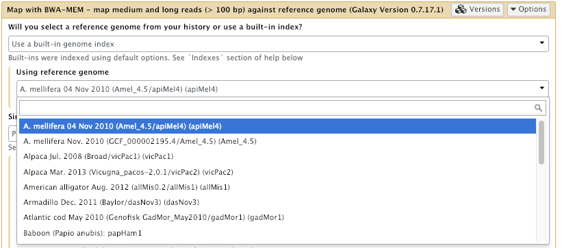
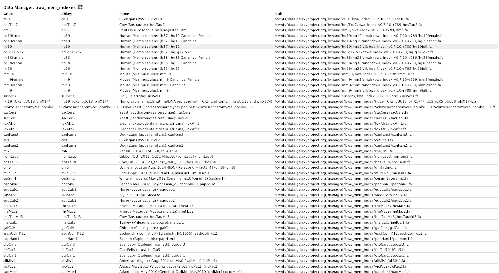

### GCCBOSC2018 - Portland, OR

# Shared Reference Genomes and Indices - Exercise

## Learning Outcomes

By the end of this tutorial, you should:

1. Have an understanding of what CVMFS is and how it works
2. Install and configure the CVMFS client on a linux machine and mount the Galaxy reference data repository
3. Configure your Galaxy to use these reference genomes and indices

## Introduction

A slideshow presentation on this subject can be found [here](https://galaxyproject.github.io/dagobah-training/2019-pennstate/05-reference-genomes/reference_genomes.html#28)

More details on the usegalaxy.org (Galaxy Main's) reference data setup and CVMFS system can be found [here](https://galaxyproject.org/admin/reference-data-repo/#usegalaxyorg-reference-data)

### The Cern-VM file system (CVMFS).

The CernVM-FS is a distributed filesystem perfectly designed for sharing readonly data across the globe. We use it in the **[Galaxy Project](https://galaxyproject.org)** for sharing things that a lot of Galaxy servers need. Namely:
* **Reference Data**
    * Genome sequences for hundreds of useful species.
    * Indices for the genome sequences
    * Various bioinformatic tool indices for the available genomes
* **Tool containers**
    * **[Singularity](https://www.sylabs.io/)** containers of everything stored in **[Biocontainers](https://biocontainers.pro/)** (A bioinformatic tool container repository.) You get these for free everytime you build a **[Bioconda](https://bioconda.github.io/)** recipe/package for a tool.
* Others too..

From the Cern website:

*"The CernVM File System provides a scalable, reliable and low-maintenance software distribution service. It was developed to assist High Energy Physics (HEP) collaborations to deploy software on the worldwide-distributed computing infrastructure used to run data processing applications. CernVM-FS is implemented as a POSIX read-only file system in user space (a FUSE module). Files and directories are hosted on standard web servers and mounted in the universal namespace /cvmfs." - [https://cernvm.cern.ch/portal/filesystem](https://cernvm.cern.ch/portal/filesystem)*

### CVMFS and Galaxy

The Galaxy project supports a few CVMFS repositories.


| Repository | Repository Address | Contents |
| ---------- | ------------------ | -------- |
| Reference Data and Indices | `data.galaxyproject.org` | Genome sequences and their tool indices, Galaxy `.loc` files for them as well |
| Singularity Containers | `singularity.galaxyproject.org` | Singularity containers for everything in Biocontainers for use in Galaxy systems |
| Galaxy Main Configuration | `main.galaxyproject.org` | The configuration files etc for Galaxy Main (usegalaxy.org) |

## Setting up an instance to access a CVMFS repository

We are going to setup a CVMFS mount to the Galaxy reference data repository on our machines. To do this we have to install and configure the CVMFS client and then mount the appropriate CVMFS repository using the publicly available keys.

#### Step 1: Install the CVMFS client

We need to first install the Cern software apt repo and then the cvmfs client and config utility

```bash
sudo apt install lsb-release
wget https://ecsft.cern.ch/dist/cvmfs/cvmfs-release/cvmfs-release-latest_all.deb
sudo dpkg -i cvmfs-release-latest_all.deb
rm -f cvmfs-release-latest_all.deb
sudo apt-get update

sudo apt install cvmfs cvmfs-config
```

Now we need to run the cvmfs setup script.

```bash
sudo cvmfs_config setup
```

#### Step 2: Create some config files and a directory

**default.local**

Create a `/etc/cvmfs/default.local` file with the following contents:

```
CVMFS_REPOSITORIES="data.galaxyproject.org"
CVMFS_HTTP_PROXY="DIRECT"
CVMFS_QUOTA_LIMIT="4000"
CVMFS_CACHE_BASE="/srv/cvmfs/cache"
CVMFS_USE_GEOAPI=yes
```

This tells cvmfs to mount the Galaxy reference data repository and use a specific location for the cache which is limited to 4GB in size and to use the instance's geo-location to choose the best CVMFS repo server to connect to.

**galaxyproject.org.conf**

Create a `/etc/cvmfs/domain.d/galaxyproject.org.conf` file with the following contents:

```
CVMFS_SERVER_URL="http://cvmfs1-tacc0.galaxyproject.org/cvmfs/@fqrn@;http://cvmfs1-iu0.galaxyproject.org/cvmfs/@fqrn@;http://cvmfs1-psu0.galaxyproject.org/cvmfs/@fqrn@;http://galaxy.jrc.ec.europa.eu:8008/cvmfs/@fqrn@;http://cvmfs1-mel0.gvl.org.au/cvmfs/@fqrn@;http://cvmfs1-ufr0.galaxyproject.eu/cvmfs/@fqrn@"
```

This is a list of the available tier1 servers that have this repo. Note there is one in Penn State. We will most likely be connecting to this one.

**data.galaxyproject.org.pub**

Create a `/etc/cvmfs/keys/data.galaxyproject.org.pub` file with the following contents:

```
-----BEGIN PUBLIC KEY-----
MIIBIjANBgkqhkiG9w0BAQEFAAOCAQ8AMIIBCgKCAQEA5LHQuKWzcX5iBbCGsXGt
6CRi9+a9cKZG4UlX/lJukEJ+3dSxVDWJs88PSdLk+E25494oU56hB8YeVq+W8AQE
3LWx2K2ruRjEAI2o8sRgs/IbafjZ7cBuERzqj3Tn5qUIBFoKUMWMSIiWTQe2Sfnj
GzfDoswr5TTk7aH/FIXUjLnLGGCOzPtUC244IhHARzu86bWYxQJUw0/kZl5wVGcH
maSgr39h1xPst0Vx1keJ95AH0wqxPbCcyBGtF1L6HQlLidmoIDqcCQpLsGJJEoOs
NVNhhcb66OJHah5ppI1N3cZehdaKyr1XcF9eedwLFTvuiwTn6qMmttT/tHX7rcxT
owIDAQAB
-----END PUBLIC KEY-----
```

**galaxyIndices**

Make a directory for the cache files

```
sudo mkdir /srv/cvmfs
```

#### Step 3: Check to see if it is working

Probe the connection.

```
sudo cvmfs_config probe data.galaxyproject.org
```

If this doesn't return `OK` then you may need to restart autofs: `sudo systemctl restart autofs`

#### Step 4: Look at the repository

Go and take a look in `/cvmfs/data.galaxyproject.org`. You will see the contents of the repo. There is quite a lot of data here all available and ready to go..

You'll notice also that the directory doesn't exist **until you try to `cd` to it!**

Have a browse through the contents. You'll see `.loc` files, genomes and indices.

And just like that we all have access to all the reference genomes and associated tool indices thanks to the Galaxy Project's and mostly Nate's hard work!

## Configuring Galaxy to use the CVMFS references.

Now that we have mounted the cvmfs repository we need to tell Galaxy how to find it and use it.

There are two primary directories in the reference data repository:

| Directory | Contents |
|-----------|----------|
| `/managed`    | Data generated with Galaxy Data Managers, organized by data table (index format), then by genome build.|
| `/byhand`     | Data generated prior to the existence/use of Data Managers, manually curated. (For legacy reasons, this directory is shared as `/indexes` on the HTTP and rsync servers.) |

These directories have somewhat different structures:

* `/managed` is organized by index type, then by genome build (Galaxy dbkey)
* `/byhand` is organzied by genome build, then by index type

Both directories contain a location subdirectory, and each of these contain a `tool_data_table_conf.xml` file:

* `/managed/location/tool_data_table_conf.xml`
* `/byhand/location/tool_data_table_conf.xml`

Galaxy consumes these `tool_data_table_conf.xml` files and the `.loc` "location" files they reference. The paths contained in these files are valid if the data is mounted via CVMFS.

Examples of data include:

* twoBit (`.2bit`) and FASTA (`.fa`) sequence files
* Bowtie 2 and BWA indexes
* Mutation Annotation Format (`.maf`) files
* SAMTools FASTA indexes (`.fai`)

Now all we need to do is tell Galaxy how to find it!

#### Step 1: Edit the `galaxy.yml` file.

Make the following changes to the `tool_data_table_config_path:` entry in your Galaxy config file.

```yaml
tool_data_table_config_path: /cvmfs/data.galaxyproject.org/byhand/location/tool_data_table_conf.xml,/cvmfs/data.galaxyproject.org/managed/location/tool_data_table_conf.xml,config/tool_data_table_conf.xml
```

This adds the two cvmfs data tables to the config. Of course we need to restart Galaxy.

```bash
sudo supervisorctl restart gx:
```

#### Step 2: Check tools now have access to genomes

In your Galaxy interface, open the `bwa`, `bwa-mem` or `Bowtie2` tool interface (whichever you may have installed). Now check that there are a lot more Genomes available for use!



The Admin interface also has a good display of installed indices for genomes.

Go to: **Admin -> Local Data -> View Tool Data Table Entries -> bwa_mem indexes**




*That's all folks.. Hope it was useful!*
