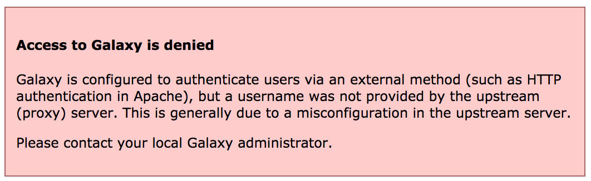

 

### GATC - 2017 - Melbourne

# Upstream Authentication - Exercise

#### Authors: Nate Coraor. 2017

## Learning Outcomes

1. By the end of this session you should be familiar with configuring Galaxy to use an upstream (proxy) authentication provider
2. Be able to log in to your Galaxy server with a file-configured user

## Introduction

For this exercise we will use a basic password file method for authenticating - this is probably not a very useful method in production, but it demonstrates how the proxy server can be configured to provide the correct header to Galaxy, and how Galaxy integrates with upstream authentication providers.

## Section 1 - Configure nginx

**Part 1 - Configure nginx**

Begin by editing `/etc/nginx/sites-available/galaxy` (as root) and modifying the `location / { ... }` block. It should now look something like this:

```nginx
    location / {
        #proxy_pass          http://galaxy;
        #proxy_set_header    X-Forwarded-Host $host;
        #proxy_set_header    X-Forwarded-For  $proxy_add_x_forwarded_for;
        uwsgi_pass           127.0.0.1:4001;
        include              uwsgi_params;
        auth_basic           galaxy;
        auth_basic_user_file /etc/nginx/passwd;
        uwsgi_param          HTTP_REMOTE_USER $remote_user;
    }
```

**Part 2 - Create passwd file**

You can use the `openssl passwd` command to do this (replace `nate` with a username of your choosing`):

```console
$ echo "nate:$(openssl passwd qwerty)" | sudo tee /etc/nginx/passwd
```

## Section 2 - Configure Galaxy

Galaxy needs to be instructed to expect authentication to come from the upstream proxy. In order to do this, we'll set two options in `galaxy.ini`:

```ini
use_remote_user = True
remote_user_maildomain = bx.psu.edu
```

Set the `remote_user_maildomain` option to the appropriate domain name for your site. Then, restart Galaxy.

If you visit your Galaxy server now you should see the following message:



This is because we have not yet restarted nginx. Galaxy expects the `REMOTE_USER` header to be set by nginx. If it's not, Galaxy will refuse to allow access to its UI.

## Section 3 - Test

**Part 1 - Test**

Restart nginx with `sudo systemctl restart nginx`. You should now be presented with a password dialog when attempting to load the Galaxy UI.

Log in using the username and password you provided when creating the `passwd` file. If your username and the value of `remote_user_maildomain` match an existing user, you will be logged in to that account. If not, a new account will be created for that user.

Note that some user features are not available when remote user support is enabled.

Try logging out by selecting **User** -> **Logout**. You'll discover that when returning to the user interface, you are still logged in. This is because Galaxy has no way of logging you out of the proxy's authentication system. Instead, you should set `remote_user_logout_href` in `galaxy.ini` to point to the URL of your authentication system's logout page.

**Part 2 - Undo changes**

We don't want to leave Galaxy this way for the rest of our workshop. Undo the changes by commenting `use_remote_user` from `galaxy.ini` and restarting Galaxy, and by commenting the options we added to `/etc/nginx/sites-available/galaxy` and restarting nginx.
